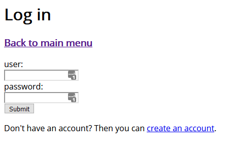
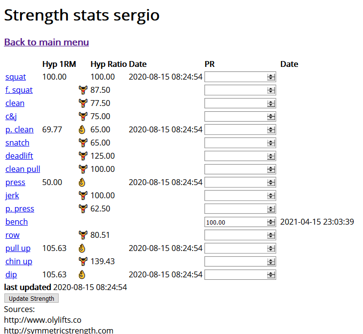

# xampp
Sample php-mysql web application.

## Installation
Download xampp from https://www.apachefriends.org and drop the files of this repo in the xampp folder

## Database backup
If the mysql database has import problems then drop the database coolwork_db and run the sql queries found in the files coolwork_db.sql and nutritionfacts.sql

## Run
Run the app by starting Appache and Mysql from xampp and go open in the browser the url /localhost:80 

## Features
### Login

### Workout plan

### Strength stats

### Diet plan

### Supermarket product mapping to USDA food nutrient

### Leaflet museum and trains map of NL

